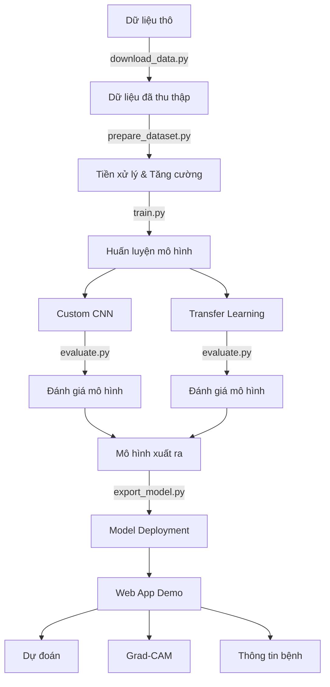

# Hệ thống Phát hiện Bệnh trên Da Xoài

Dự án này phát triển một hệ thống nhận diện bệnh trên da xoài sử dụng kỹ thuật deep learning. Dự án bao gồm các thành phần: tiền xử lý dữ liệu, huấn luyện mô hình, đánh giá và triển khai thành web app demo.

## Các tính năng chính

- **Thu thập dữ liệu**: Công cụ tải và tổ chức dữ liệu ảnh xoài
- **Tiền xử lý dữ liệu**: Các kỹ thuật chuẩn hóa và tăng cường dữ liệu
- **Mô hình AI**:
  - Custom CNN từ đầu
  - Transfer Learning với MobileNetV2, VGG16, ResNet50, EfficientNet
- **Đánh giá**: Các công cụ trực quan hóa và đánh giá hiệu suất mô hình
- **Ứng dụng Web**: Giao diện người dùng cho phép tải lên ảnh và nhận kết quả phân tích

## Cấu trúc dự án

```
mango-disease-detection/
├── app/                    # Ứng dụng web Flask
├── configs/                # Tệp cấu hình YAML
├── data/                   # Thư mục dữ liệu
│   ├── raw/                # Dữ liệu gốc
│   ├── processed/          # Dữ liệu đã tiền xử lý
│   └── augmented/          # Dữ liệu đã tăng cường
├── docs/                   # Tài liệu
├── models/                 # Mô hình đã huấn luyện
├── notebooks/              # Jupyter notebooks cho phân tích
├── scripts/                # Scripts hữu ích
├── src/                    # Mã nguồn chính
│   ├── data/               # Xử lý dữ liệu
│   ├── inference/          # Mã cho dự đoán
│   ├── models/             # Định nghĩa mô hình
│   ├── training/           # Code huấn luyện và đánh giá
│   └── utils/              # Tiện ích
├── tests/                  # Unit tests
├── .gitignore
├── LICENSE
├── main.py                 # Điểm vào chính
├── requirements.txt        # Các thư viện phụ thuộc
├── README.md
└── setup.py
```

## Bệnh được phát hiện

Dự án hiện có thể nhận diện 4 loại bệnh/tình trạng:

1. **Bệnh thán thư** (Anthracnose): Gây ra vết đốm đen hoặc nâu trên lá và quả
2. **Bệnh loét vi khuẩn** (Bacterial Canker): Gây ra các vết loét trên lá, cành và quả
3. **Bệnh phấn trắng** (Powdery Mildew): Tạo lớp phủ trắng như bột trên lá, hoa, quả non
4. **Cây khỏe mạnh** (Healthy): Không có dấu hiệu bệnh

## Cài đặt

### Yêu cầu

- Python 3.7+
- TensorFlow 2.x
- Flask
- Các thư viện khác (xem requirements.txt)

### Cài đặt từ source

```bash
# Clone repository
git clone https://github.com/your-username/mango-disease-detection.git
cd mango-disease-detection

# Tạo môi trường ảo (tùy chọn nhưng khuyến nghị)
python -m venv venv
source venv/bin/activate  # Linux/Mac
# hoặc
venv\Scripts\activate  # Windows

# Cài đặt các gói phụ thuộc
pip install -r requirements.txt
```

## Hướng dẫn sử dụng

### Tải và chuẩn bị dữ liệu

```bash
# Tải dữ liệu từ nguồn
python scripts/download_data.py --url <url_to_dataset>

# Chuẩn bị dataset
python scripts/prepare_dataset.py --input_dir data/raw --output_dir data --augment
```

### Huấn luyện mô hình

```bash
# Huấn luyện Custom CNN
python main.py --mode train --config configs/custom_cnn_config.yaml --model_type custom_cnn

# Hoặc huấn luyện với Transfer Learning
python main.py --mode train --config configs/transfer_learning_config.yaml --model_type transfer_learning
```

### Đánh giá mô hình

```bash
# Đánh giá Custom CNN
python main.py --mode evaluate --config configs/custom_cnn_config.yaml --model_type custom_cnn

# Đánh giá Transfer Learning
python main.py --mode evaluate --config configs/transfer_learning_config.yaml --model_type transfer_learning
```

### Dự đoán trên ảnh cụ thể

```bash
python main.py --mode predict --config configs/transfer_learning_config.yaml --model_type transfer_learning --image_path path/to/your/image.jpg
```

### Chạy ứng dụng web

```bash
# Chạy ứng dụng web Flask
export FLASK_APP=app
export FLASK_ENV=development
flask run --host=0.0.0.0 --port=5000
```

Sau đó, truy cập ứng dụng web tại http://localhost:5000

## Tùy chỉnh cấu hình

Bạn có thể tùy chỉnh các thông số mô hình và huấn luyện bằng cách chỉnh sửa tệp YAML trong thư mục `configs/`. Hai cấu hình mặc định được cung cấp:

- `custom_cnn_config.yaml`: Cho mô hình CNN thiết kế từ đầu
- `transfer_learning_config.yaml`: Cho các mô hình Transfer Learning

## Giao diện Web

Ứng dụng web cung cấp các tính năng:

1. **Trang chủ**: Tải lên và phân tích ảnh
2. **Kết quả phân tích**: Hiển thị dự đoán, biểu đồ xác suất, và Grad-CAM
3. **Thông tin bệnh**: Mô tả các loại bệnh, triệu chứng và cách điều trị

## Đóng góp

Đóng góp luôn được hoan nghênh! Vui lòng tạo issue hoặc gửi pull request trên GitHub.

## Giấy phép

[Thêm thông tin giấy phép của bạn ở đây]

## Liên hệ

[Thêm thông tin liên hệ của bạn ở đây]

---

## Ví dụ về kết quả

Hệ thống cung cấp nhiều dạng kết quả trực quan:

1. **Dự đoán phân loại**: Xác định loại bệnh và độ tin cậy
2. **Grad-CAM**: Vùng ảnh hưởng đến quyết định của mô hình
3. **Thông tin chi tiết**: Hướng dẫn về triệu chứng và cách điều trị

## Tài liệu tham khảo

- [Thêm các tài liệu tham khảo của bạn ở đây]